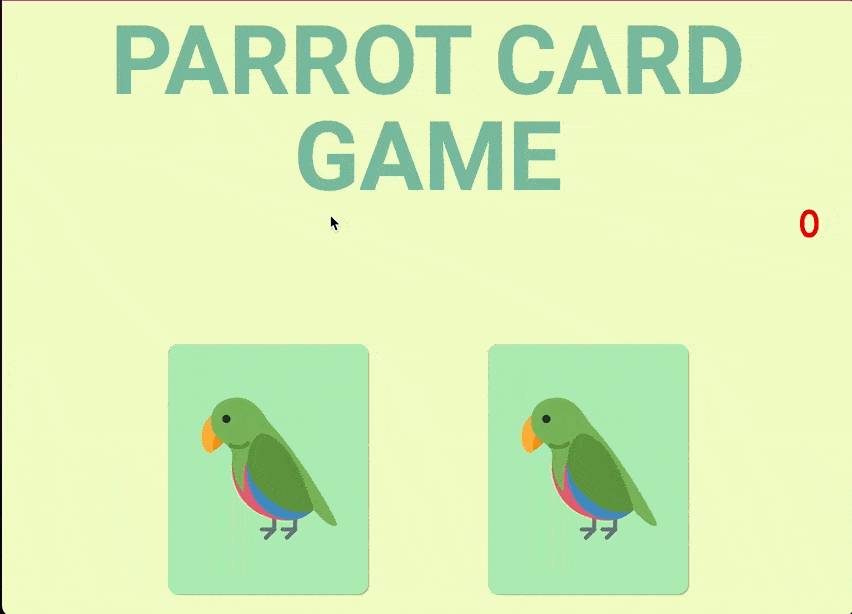

# Parrot Card Game

## My second JavaScript project is the implementation of the Parrot Card Game, a themed memory game with randomness, effects and transition, responsive design and dancing parrots!

## How it works

- The player must inform the number of cards he wants to play;
- The game starts and then the player must flip the cards one by one;
- When two cards are flipped, check if they are the same, if not, they are unflipped;
- When a pair is formed, that pair remains face up and it can't be unflipped;
- As soon as the player flipped all the cards, the game ends and he wins.

